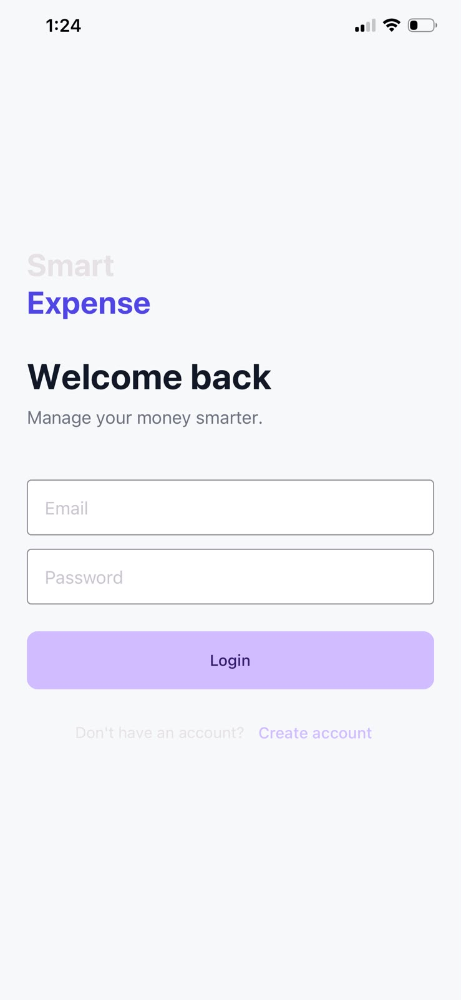
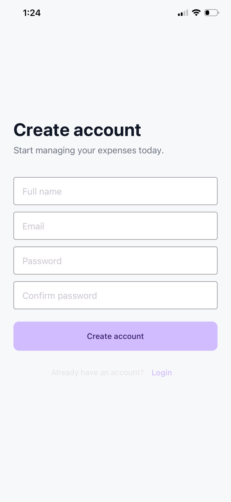
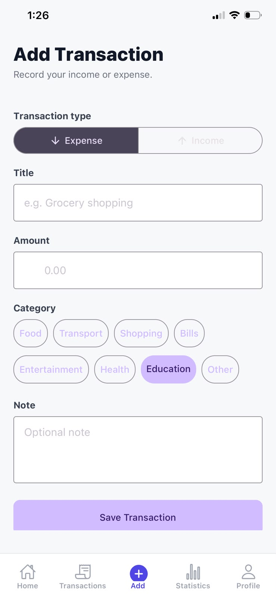
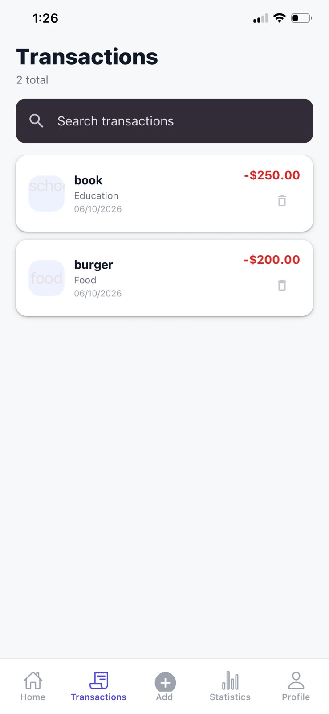
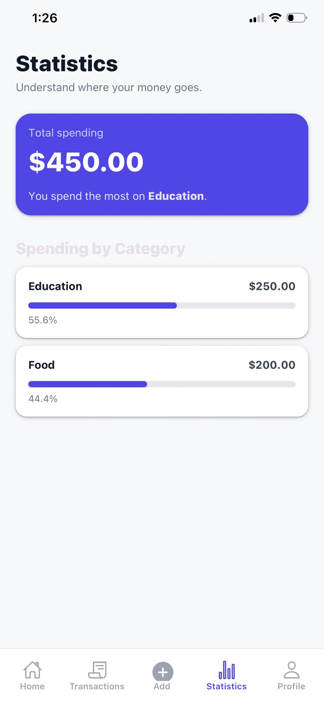
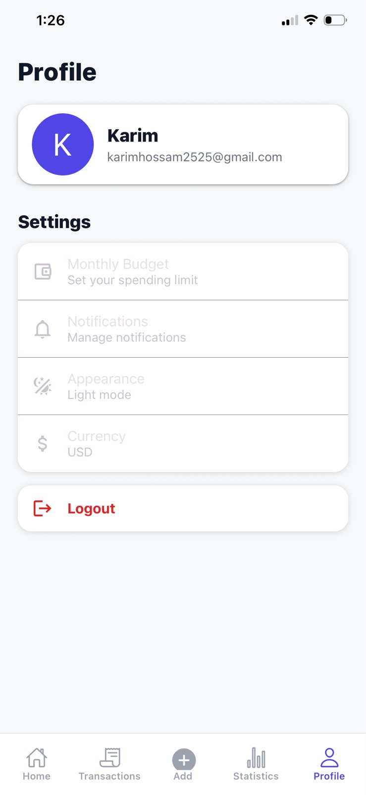

# Smart Expense Tracker

<p align="center">
<<<<<<< HEAD
  
=======
  
>>>>>>> 7673f78 (Add auth, tabs, context and types; update layout and config)
</p>

<p align="center">
  A React Native expense management app for tracking expenses, managing budgets, and analyzing spending.
</p>

## Screenshots

<table>
  <tr>
    <td></td>
    <td></td>
    <td></td>
    <td></td>
  </tr>
  <tr>
    <td></td>
    <td></td>
    <td></td>
  </tr>
</table>

## Features

- User registration and login
- Persistent authentication
- Add, edit, and delete expenses
- Expense categories
- Monthly budgets and spending alerts
- Spending insights and monthly comparisons
- Statistics and interactive charts
- Date selection
- Dark mode
- Local data persistence
- Form validation

## Tech Stack

- React Native
- Expo
- TypeScript
- Expo Router
- React Native Paper
- React Hook Form
- Zod
- AsyncStorage
- React Native Gifted Charts

## Installation

```bash
git clone https://github.com/YOUR_USERNAME/smart-expense-tracker.git
cd smart-expense-tracker
npm install
npx expo start
```

Run with Expo Go, Android Emulator, or iOS Simulator.

## Project Purpose

A portfolio project demonstrating mobile development, authentication, local storage, form validation, navigation, data visualization, and responsive UI design.

## Author

**Karim Hossam**

- GitHub: https://github.com/kareem-2004
- LinkedIn: https://linkedin.com/in/karim-hussam
